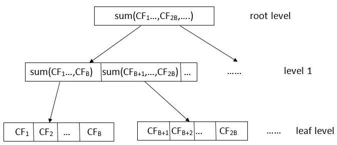
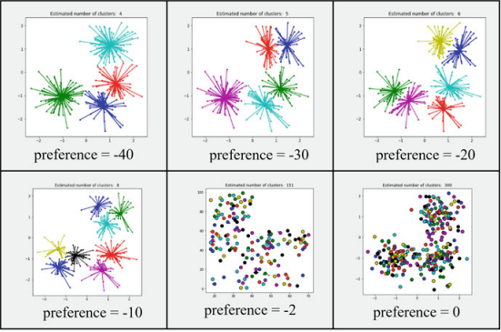

# <!--fit--> Алгоритмы кластеризации
Голубев Максим, 21202

---
# BIRCH

---
# Что такое **BIRCH** 

* Сбалансированное итеративное сокращение и кластеризация с использованием иерархий
* Большой набор данных в меньшие подкластеры
* Эти подкластеры кластеризуются другими алгоритмами
* Работает только с метрическими параметрами
---
# Почему стоит использовать **BIRCH** 

* Огромный объем данных
* Маленький расход ресурсов
* Фокус на плотности данных
* Один проход по данным
* Устойчив к шумам
---
# Ключевые понятия
---
# Нужные формулы
* ${\displaystyle {\overrightarrow {C}}={\frac {\sum _{i=1}^{N}{\overrightarrow {X_{i}}}}{N}}={\frac {\overrightarrow {LS}}{N}}}$
* ${\displaystyle R={\sqrt {\frac {\sum _{i=1}^{N}({\overrightarrow {X_{i}}}-{\overrightarrow {C}})^{2}}{N}}}={\sqrt {\frac {N\cdot {\overrightarrow {C}}^{2}+SS-2\cdot {\overrightarrow {C}}\cdot {\overrightarrow {LS}}}{N}}}={\sqrt {{\frac {SS}{N}}-({\frac {\overrightarrow {LS}}{N}})^{2}}}}$
---

# **CF**: Характеристика кластеризации
Это упроядоченная тройка: $(N,LS,SS)$
* $N$ - количество точек данных в кластере
* $LS= \sum_{i=1}^N X_i$ - линейная сумма точек данных в кластере
* $SS= \sum_{i=1}^N (X_i)^2$ - сумма квадратов значений точек данных в кластере
---

# **CF-Tree**:  Дерево характеристик кластеризации
Это древовидная структура данных, используемая алгоритмом BIRCH, которая позволяет эффективно выполнять кластеризацию больших наборов данных, не храня все точки данных в памяти

---
# Струкутура **CF-дерева**
* **Листовые узлы**
  * хранят CF-записи, представляющие кластеры
  * хранят указателями "вперед" и "назад", образуя двусвязный список 
* **Нелистовые узлы**
  * Хранят указатели на дочерние узлы и CF-записи

---
# Параметры **CF-дерева**
* **B** - фактор ветвления
* **L** - максимальное количество CF-записей, которые может хранить листовой узел
* **T**- порог диаметра кластера
---


---
# Построение **CF-дерева**
* Создание CF-записей
* Вставка CF-записей в дерево
* Проверка порога диаметра кластера

---
# Пример

Итак, рассмотрим набор одномерных объектов {22,9,12,15,18,27,11,36,10,3,14,32}. Пусть коэффициент ветвления B=2 и порог диаметра T=5

---
# Реализация 
```python
class sklearn.cluster.Birch(*, threshold=0.5,
 branching_factor=50,
 n_clusters=3,
 compute_labels=True,
 copy=True)
```

---
# CLARANS
---
# Что такое **CLARANS**?

- Кластеризация для больших приложений с рандомизированным поиском
- Расширение алгоритма CLARA
- Устраняет ограничения K-medoids для больших данных
- Использует рандомизированный поиск для баланса между эффективностью и качеством

---

# Как работает **CLARANS**?
---

**Входные параметры:**
- `numlocal`: количество итераций
- `maxneighbor`: макс. число исследуемых соседей
- `k`: желаемое количество кластеров
---

**Итеративный процесс:**
- Повторять `numlocal` раз:
- Выбрать `k` случайных точек как medoids
- Сформировать кластеры, используя `maxneighbor` соседей
- Рассчитать стоимость кластеризации
- Если стоимость минимальна, сохранить medoids
---

**Результат:**
- Лучший набор medoids и кластеры

---

# Преимущества **CLARANS**

- **Эффективнее PAM и CLARA:**
  - Ограничивает число исследуемых соседей
- **Хорошо масштабируется:**
  - Работает с большими и высокоразмерными данными
- **Гибкий:**
  - Поддерживает разные функции расстояния
- **Поддерживает полигональные объекты:**
  - Не ограничивается точечными объектами
- **Высокое качество кластеризации:**
  - Лучше, чем у CLARA

---

# Недостатки **CLARANS**

- **Требует много памяти:**
  - Неэффективен при обширных операциях ввода-вывода

---

# Реализация

- Доступна в библиотеке PyClustering
```python
clarans_obj = clarans(wine_data, number_clusters = 2, numlocal = 3, maxneighbor = 5)
```

---
# Affinity Propagation Clustering
---
# Что такое **Affinity Propagation Clustering** ? 
Это алгоритм **кластеризации методом распространения близости**

* Не требует заранее задавать количество кластеров
* Автоматически определяет "образцовые" точки данных
---
# Как работает алгоритм ?
---
# Ключевые понятия
* **Матрица схожести**: ${\displaystyle s(i,k)=-\left\|x_{i}-x_{k}\right\|^{2}}$
* **Матрица ответственности**: ${\displaystyle r(i,k)\leftarrow s(i,k)-\max _{k'\neq k}\left\{a(i,k')+s(i,k')\right\}}$
* **Матрица доступности**: 
  + ${\displaystyle a(i,k)\leftarrow \min \left(0,r(k,k)+\sum _{i'\not \in \{i,k\}}\max(0,r(i',k))\right)}$
  + ${\displaystyle a(k,k)\leftarrow \sum _{i'\neq k}\max(0,r(i',k))}$
---
# Алгоритм
1) **Создание матрицы сходства**
2) **Передача сообщений**
    + Ответственность
    + Доступность
    + Итеративный процесс 
3) **Определение "образцовых" точек**
4) **Формирование кластеров**

---
# Обновление значений

$\lambda$ - сглаживающий фактор
+ $r_{t+1}(i,k) = \lambda r_t(i,k) + (1-\lambda)r_{t+1}(i,k)$
+ $a_{t+1}(i,k) = \lambda a_t(i,k) + (1-\lambda)a_{t+1}(i,k)$
---
# Преимущества
* Не требует заранее задавать количество кластеров
* Автоматически определяет "образцовые" точки данных

# Недостатки
* Для относительно небольших и средних наборов данных $N \leq 10^5-10^7$ 
* $O(n^2 logn)$

---
# Реализациия
```python
model = AffinityPropagation(preference=-50).fit(X)
```
---



---
# STING & CLIQUE
---
